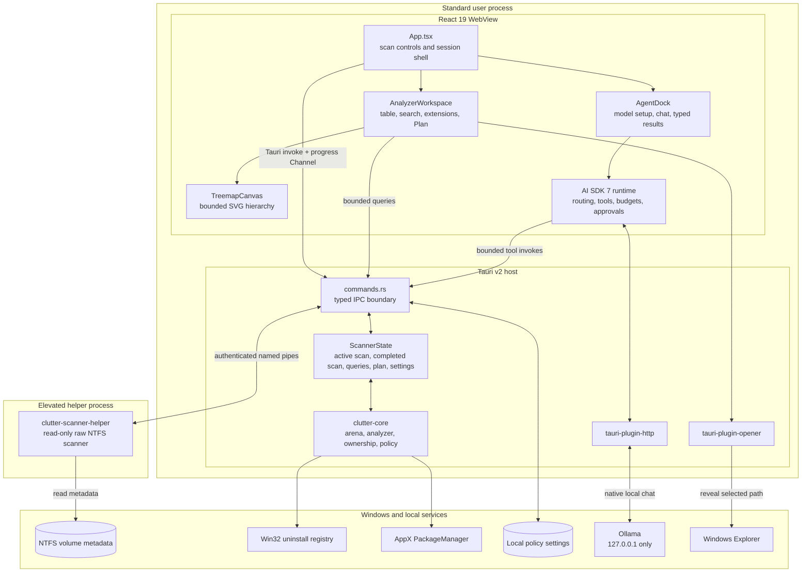
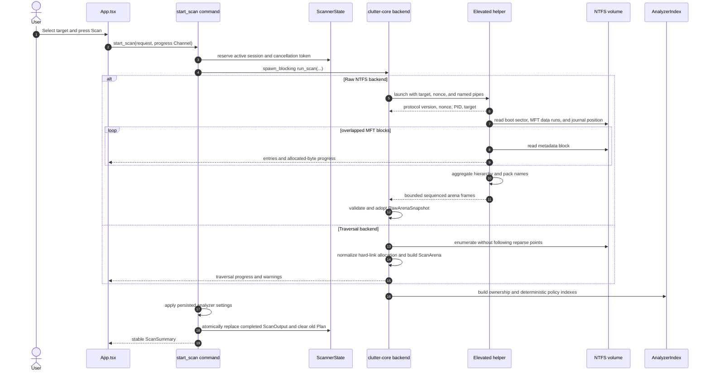
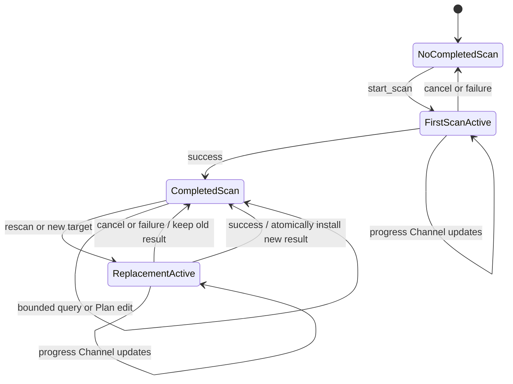
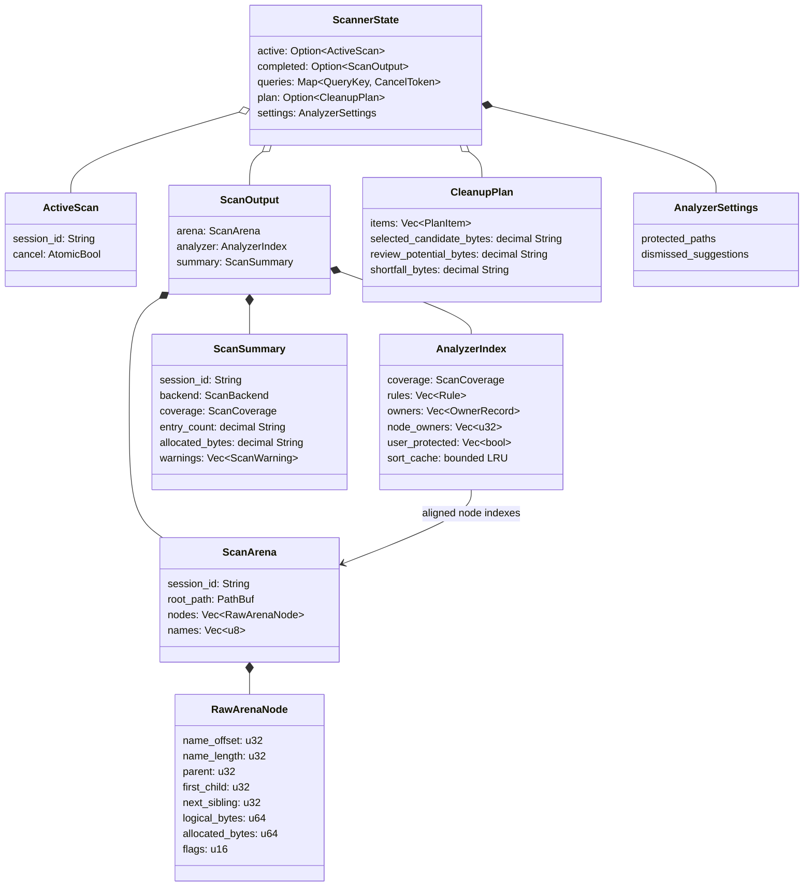
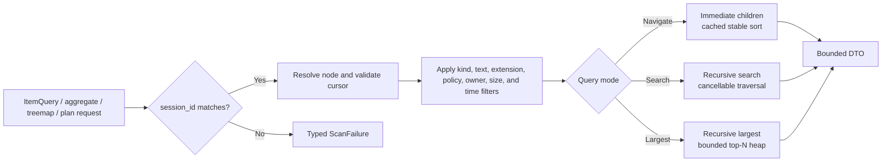
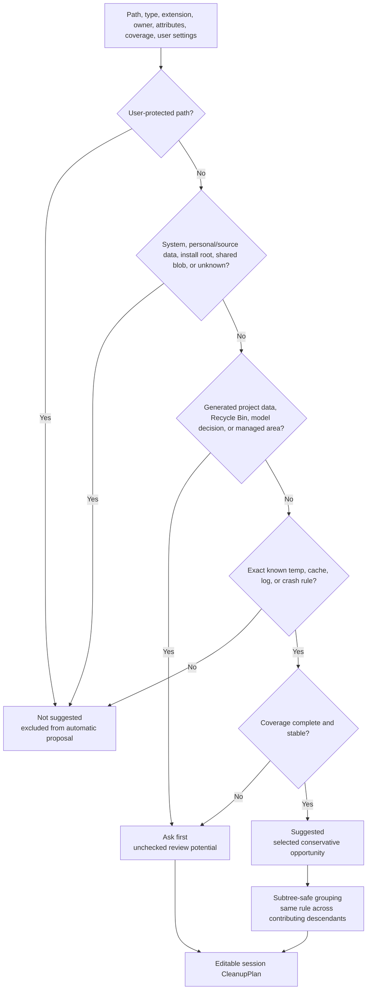
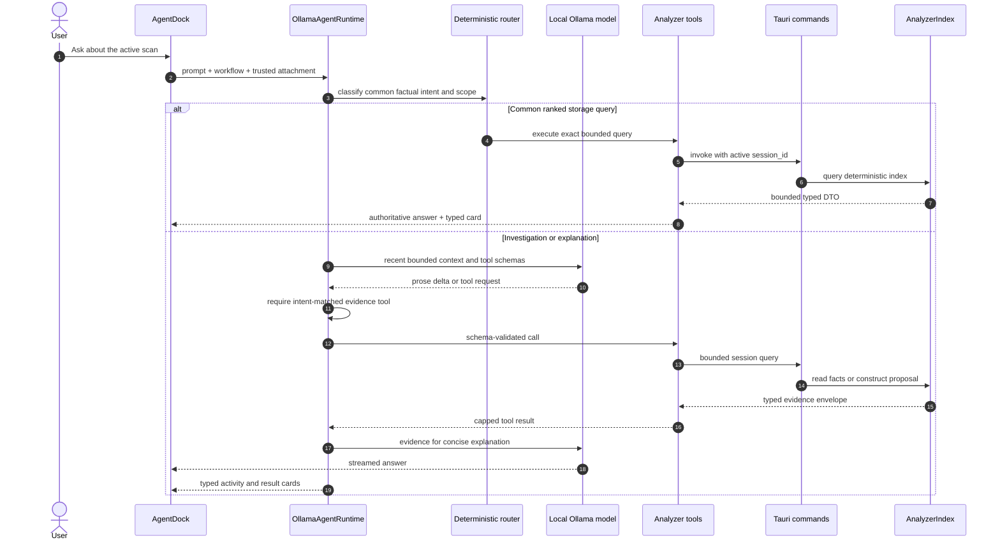
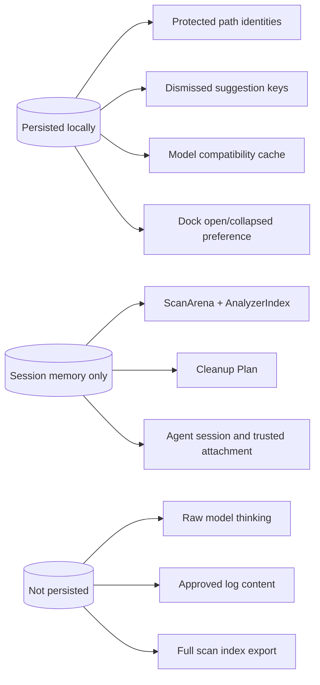

# ClutterHunter Architecture

ClutterHunter is a Windows desktop storage analyzer with a read-only Rust data
plane and an optional on-device AI control plane. Rust owns filesystem facts,
policy, and cleanup-plan construction. React owns presentation and interaction.
The local model can request bounded evidence but cannot read the filesystem or
change safety classifications itself.

## System Map

### Trust Boundaries

| Boundary | Allowed | Not allowed |
| --- | --- | --- |
| React WebView to Tauri | Registered typed commands and progress channels | Direct raw-volume access or arbitrary native calls |
| Tauri host to helper | Versioned scan protocol, bounded frames, progress, cancellation | General elevated command execution |
| Agent to analyzer | Schema-validated, session-bound, bounded evidence tools | Raw arena access, arbitrary file reads, shell, writes, or deletion |
| Agent to Ollama | Numeric port on `127.0.0.1` | LAN, remote, cloud, redirected, or credential-bearing endpoints |
| Policy to Plan | Deterministic tiers, reasons, warnings, and grouped proposals | Model-created eligibility or silent protection bypass |

## Source Ownership

| Area | Primary files | Responsibility |
| --- | --- | --- |
| Application shell | `src/App.tsx` | Target discovery, scan lifecycle, progress, summary, dock visibility |
| Analyzer UI | `src/AnalyzerWorkspace.tsx` | Bounded navigation, virtual rows, search, sorting, selection, aggregates, Plan |
| Treemap | `src/analyzer/treemap.ts`, `src/analyzer/TreemapCanvas.tsx` | Convert bounded Rust slice into linked SVG hierarchy |
| Agent UI | `src/AgentDock.tsx` | Ollama setup, chat, approvals, result cards, Plan handoff |
| Agent runtime | `src/agent/runtime.ts` | Intent routing, AI SDK loop, context, tool selection, streaming, cancellation |
| Agent tools | `src/agent/tools.ts` | Zod schemas, scope resolution, budgets, Tauri analyzer calls |
| Ollama boundary | `src/agent/endpoint.ts`, `ollama.ts`, `harness.ts`, `catalog.ts` | Loopback enforcement, discovery, preflight, compatibility, model ranking |
| Generated IPC types | `src/bindings/*` | TypeScript DTOs generated from Rust with `ts-rs` |
| Tauri commands | `src-tauri/src/commands.rs` | Native API, shared state, session checks, settings persistence |
| Scan core | `src-tauri/crates/clutter-core/src/backend.rs`, `arena.rs` | Backend selection, compact arena construction/adoption, scan summary |
| Analyzer core | `src-tauri/crates/clutter-core/src/analyzer.rs` | Queries, indexes, ownership links, policy, aggregates, treemap, plans |
| Traversal backend | `src-tauri/crates/clutter-core/src/traversal.rs` | Read-only filesystem traversal fallback |
| Raw helper host | `src-tauri/crates/clutter-core/src/raw_snapshot.rs` | Helper launch, authenticated pipes, frame validation, cancellation |
| Raw helper | `src-tauri/crates/clutter-scanner-helper/src/raw_mft.rs` | MFT reads, NTFS parsing, hierarchy and allocation accounting |
| Shared protocol | `src-tauri/crates/clutter-protocol/src/lib.rs` | Protocol version, flags, frames, raw arena DTOs, validation constants |

## Scan Pipeline

Raw NTFS and traversal both produce the same `ScanOutput`. Backend differences are
preserved in `ScanSummary`, coverage, and warnings rather than hidden from the UI.

## Scan Session State

Only one scan runs at a time. A completed scan is immutable to readers except for
explicit policy-setting reclassification. Starting a replacement scan does not
discard the previous completed result.

Every analyzer request carries the completed `session_id`. Stale node IDs,
cursors, plans, and AI attachments are rejected instead of being interpreted
against another scan.

## In-Memory Data Model

The arena stores fixed-size nodes and one packed UTF-8 name pool. Parent, child,
and sibling relationships are `u32` indexes. `AnalyzerIndex` stores aligned rule
and owner references rather than duplicating full paths for every item.

All byte counts cross IPC as decimal strings, avoiding JavaScript integer
precision loss on large volumes.

## Bounded Analyzer Queries

Core response bounds:

- item pages: at most 100 rows;
- recursive top-N: retains at most the requested 100 results;
- treemap: at most 5,000 largest file leaves plus required ancestors;
- cleanup Plan: at most 500 returned items with explicit omitted totals;
- log inspection: at most 5 approved files, 64 KiB each, 256 KiB total.

The browser never receives the complete scan tree.

## Policy and Planning

Policy is deterministic and evaluated in Rust. "Not suggested" is an AI/planner
classification, not a filesystem permission.

Size ranks opportunities only after policy eligibility is known. It never turns
an arbitrary large directory into a cleanup candidate. Installed applications,
Ollama models, Scoop data, and Windows-managed storage retain owner-native action
metadata instead of being represented as direct file deletion.

## Local Agent Flow

### Agent Controls

- Installed models must be local, have a stable digest, report tool capability,
  pass native preflight, and pass the compatibility harness.
- Common factual questions use deterministic routing where possible, removing the
  model as a correctness dependency.
- Other factual turns require an intent-matched evidence tool. Unrelated tools are
  closed after that evidence call so a speculative second query cannot replace it.
- Tool results are capped at 12 KiB each and 32 KiB per turn.
- Recent context is limited to 12 messages and 24,000 characters; older text is
  reduced to a bounded deterministic session summary.
- Turns stop after bounded steps, output, time, and invalid-call repair limits.
- Log excerpts and path protection require explicit AI SDK approval.
- Result cards are selected by a fixed local component registry, never by
  model-generated component names or props.

## Tauri Command Surface

The registered native API is intentionally narrow:

| Group | Commands |
| --- | --- |
| Discovery | `list_scan_targets`, `get_hardware_profile` |
| Scan lifecycle | `start_scan`, `cancel_scan`, `get_scan_summary` |
| Analyzer | `query_items`, `cancel_item_query`, `get_item_details`, `get_storage_aggregate`, `get_treemap_slice` |
| Evidence | `inspect_log_excerpt`, `get_cleanup_opportunities` |
| Plan | `build_cleanup_plan`, `edit_cleanup_plan` |
| Policy settings | `set_path_protection`, `dismiss_suggestion` |

Commands validate the active session before using scan-local IDs. Expensive scans
and recursive queries run through Tauri's blocking runtime rather than blocking
the WebView event loop.

## Persistence

Analyzer settings are written through a bounded, flushed atomic replacement in
the user's local application-data directory. Scan indexes, cleanup plans, and
chat sessions are discarded with the application session or when their binding
scan changes.

## Architectural Invariants

1. Rust is the source of truth for paths, sizes, ownership, policy, and plans.
2. One active scan and one completed immutable scan are retained at most.
3. Failed or cancelled replacement scans do not destroy the usable completed scan.
4. The WebView and the model receive bounded DTOs, never the raw arena.
5. Every scan-local reference is checked against the active session.
6. The fast helper is elevated; the main application and AI runtime are not.
7. Local inference is loopback-only and analyzer functionality does not depend on Ollama.
8. Policy evidence decides eligibility; size only ranks eligible opportunities.
9. No registered command or agent tool deletes, moves, recycles, uninstalls, or
   executes arbitrary code.

## Related Documentation

- [README](README.md)
- [Product specification](docs/ProductPlan.md)
- [Scanner architecture and measurements](docs/ScannerSpike.md)
- [Analyzer, policy, and planner notes](docs/AnalyzerCore.md)
- [Local agent notes](docs/LocalAgent.md)
