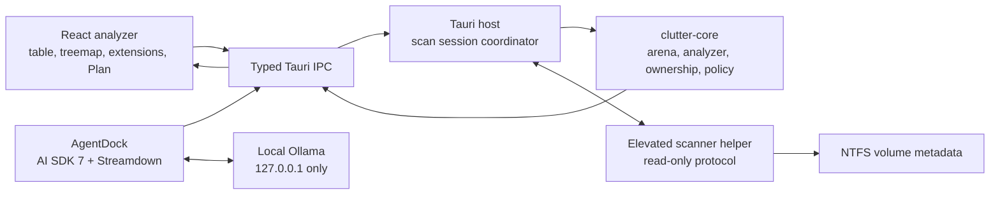
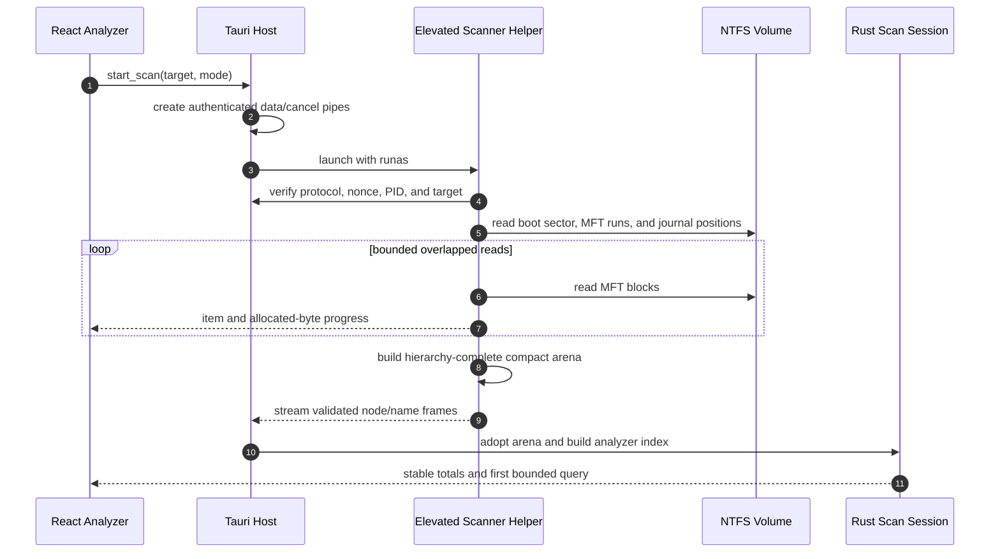
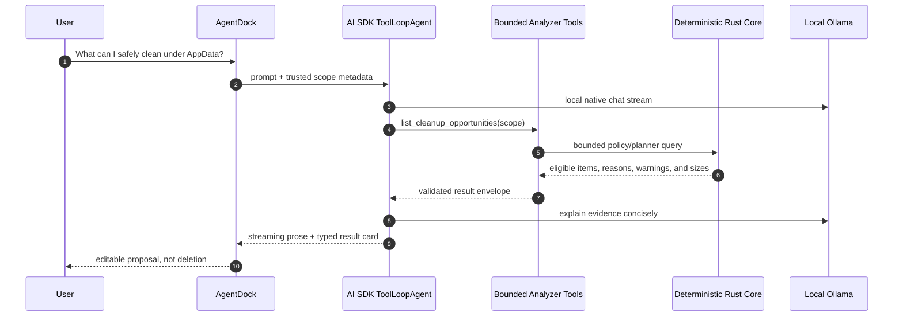

# ClutterHunter

<div align="center">
  
  <h3 align="center">Private Windows Storage Analysis With On-Device AI</h3>
  <p>
    ClutterHunter scans large Windows disks at metadata speed, turns the result
    into a navigable analyzer, and lets a local Ollama agent investigate storage
    usage and assemble evidence-backed cleanup plans.
  </p>
</div>

## Overview

ClutterHunter is a React + Tauri desktop application for Windows 10/11. Its first
layer is a storage analyzer in the class of WizTree and WinDirStat. Its second
layer is a bounded on-device agent that selectively queries the Rust scan index
instead of receiving millions of raw paths in a prompt.

The analyzer and deterministic policy engine remain authoritative. The model can
investigate, explain, and refine a plan, but it cannot invent safety
classifications or bypass the application's evidence boundary.

ClutterHunter is deliberately read-only: it scans, visualizes, explains, and
proposes. It does not delete, recycle, uninstall, move, or otherwise modify files.

### Technologies

[](https://react.dev/ "React") [](https://tauri.app/ "Tauri") [](https://www.typescriptlang.org/ "TypeScript") [](https://www.rust-lang.org/ "Rust") [](https://tailwindcss.com/ "Tailwind CSS") [](https://vite.dev/ "Vite")

- **Frontend**: React 19, TypeScript 7, Tailwind CSS 4, Vite 8
- **Desktop shell**: Tauri v2 with a Rust 2024 workspace
- **Scanner**: elevated read-only NTFS MFT helper with ordinary traversal fallback
- **Analyzer**: bounded Rust queries over a compact arena and deterministic policy engine
- **Local AI**: AI SDK 7, `ai-sdk-ollama`, Ollama native chat streaming, and Streamdown
- **Data views**: TanStack Virtual and Nivo TreeMap
- **Validation**: Zod, Vitest, React Testing Library, Playwright, and Rust tests

## Features

- **Fast NTFS scanning** through a narrow, elevated MFT helper rather than a full
  file-by-file walk
- **Explicit traversal fallback** when elevation or raw NTFS access is unavailable
- **Live scan progress and cancellation** without replacing the last completed scan
- **Dense storage navigation** with a virtualized hierarchy, breadcrumbs, scoped
  search, stable sorting, and logical/allocated size modes
- **Linked SVG treemap** with nested labels, hover evidence, full paths, selection,
  and double-click drill-down
- **Extension summaries** for quickly identifying dominant file types
- **Deterministic AI policy** that separates cleanup candidates, review-required
  items, and items the agent should not suggest
- **Application ownership evidence** from Win32 uninstall roots, AppX packages,
  and narrow known-owner mappings
- **Editable cleanup plans** with separate conservative and review totals, usable
  even when Ollama is offline
- **Private local chat** with explicit model discovery, compatibility testing,
  streaming answers, bounded tool calls, approvals, and typed result cards
- **Trusted analyzer context** so a selected item or folder can be attached to the
  next agent turn without exposing file contents
- **Evidence-backed cleanup answers** where size ranks already eligible
  opportunities but never determines whether an item is safe

## Usage

1. Open ClutterHunter and select a local volume or folder.
2. Press **Scan**. Eligible NTFS targets request elevation for the read-only MFT
   helper; unsupported or inaccessible targets can use traversal fallback.
3. Explore the completed scan through the hierarchy, search, extension summary,
   and treemap.
4. Select an item to inspect its exact path, sizes, ownership, and AI policy, or
   attach it as trusted context for chat.
5. Optionally connect a compatible local Ollama model and ask questions such as
   "What is using space under AppData?" or "What can I safely clean?"
6. Review and edit the proposed cleanup Plan. ClutterHunter does not mutate the
   filesystem.

ClutterHunter remains a complete analyzer without Ollama. Local AI is an
investigation and explanation layer, not a requirement for scanning or planning.

## Setup

### Prerequisites

- Windows 10/11 x64
- Node.js and pnpm 11+
- Rust 1.85+ with Cargo
- Microsoft Edge WebView2 Runtime
- Optional: [Ollama](https://ollama.com/) and a locally installed tool-capable model

### Install and run

```powershell
git clone https://github.com/Eshan05/ClutterHunter.git
cd ClutterHunter
pnpm install
```

```powershell
pnpm dev          # React webview only
pnpm tauri dev    # Desktop app with the scanner helper
pnpm tauri build  # Release bundles
```

Build hooks compile and stage the matching scanner helper automatically. UAC is
requested only when an eligible fast scan begins.

### Verification

```powershell
pnpm build
pnpm exec vitest run
pnpm exec playwright test
cargo test --workspace --manifest-path src-tauri/Cargo.toml
cargo clippy --workspace --all-targets --manifest-path src-tauri/Cargo.toml -- -D warnings
```

## Privacy and Safety

- Ollama endpoints are restricted to numeric ports on `127.0.0.1`; LAN, remote,
  and cloud endpoints are rejected.
- Scan results stay inside the Rust session and only bounded tool results cross
  into the model context.
- File content is never attached implicitly. Arbitrary file reads, shell access,
  web search, code execution, and filesystem write tools are not exposed.
- The elevated helper has a narrow read-only protocol, authenticated local pipes,
  bounded frames, and scan cancellation.
- AI policy labels constrain agent recommendations and cleanup plans. They do not
  pretend that the user lacks authority over their own files.
- Cleanup plans are session-only proposals and are not persisted.

## Architecture

React owns presentation and bounded AI SDK orchestration. Rust owns scan state,
storage facts, ownership, policy, and cleanup-plan construction. The elevated
helper reads NTFS metadata and streams a validated compact arena to the
non-elevated Tauri process.



### Fast Scan Flow



### Evidence-Bounded Agent Flow



The model-facing tool set includes overview, folder listing, recursive top-N,
search, folder inspection, cleanup opportunities, aggregates, exact item
evidence, approved bounded log excerpts, plan construction/editing, and path
protection. Tool arguments, result sizes, step counts, context, and time are all
bounded.

## Performance Notes

In a measured warm-cache run, ClutterHunter indexed about 7.3 million entries in
an 18.1-second median, including scanning, deterministic classification, stable
totals, and the first analyzer query. Results vary with hardware, volume layout,
cache state, and installed software.

## Project Documentation

- [Architecture guide](ARCHITECTURE.md)
- [Technical report, local AI verification, evaluation, and privacy](TECHNICAL_REPORT.md)
- [Product specification](docs/ProductPlan.md)
- [Scanner architecture and measurements](docs/ScannerSpike.md)
- [Analyzer, policy, and planner notes](docs/AnalyzerCore.md)
- [Local Ollama agent notes](docs/LocalAgent.md)
- [Technical references](docs/References.md)
